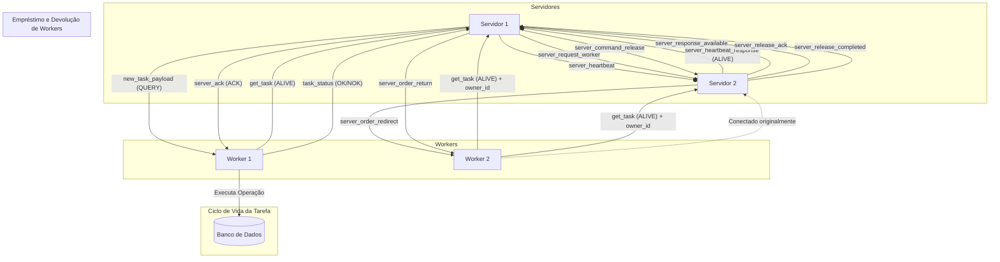

# Arquitetura de Sistema Distribuído baseado em Mensageria

**Integrantes**: João Gabriel, Carlos Eduardo e Arthur Gomes.

**Repositório**: [Jotagamaral/Arquitetura-de-Sistemas-Distribuidos-Grupo-1](https://github.com/Jotagamaral/Arquitetura-de-Sistemas-Distribuidos-Grupo-1)

## 1. Visão Geral do Projeto

Este projeto implementa um sistema distribuído em Python projetado para processar tarefas de consulta e atualização de saldos de contas. A arquitetura demonstra a comunicação assíncrona entre múltiplos serviços, balanceamento de carga dinâmico e escalabilidade de componentes.


O ecossistema é composto por:
* **Servidores (`server_runner.py` + `server_lib/`)**: Orquestradores que gerenciam workers, distribuem tarefas e comunicam-se entre si para monitoramento de carga e status (heartbeat). Toda a lógica do servidor está modularizada na pasta `server_lib/`.
* **Workers (`client.py`)**: Executores de tarefas que se conectam aos servidores e retornam resultados (fictícios).

## 2. Guia de Execução Rápida (Quick Start)

1.  **Clone o repositório:**
    ```bash
    git clone [https://github.com/Jotagamaral/Arquitetura-de-Sistemas-Distribuidos-Grupo-1.git](https://github.com/Jotagamaral/Arquitetura-de-Sistemas-Distribuidos-Grupo-1.git)
    cd Arquitetura-de-Sistemas-Distribuidos-Grupo-1
    ```

2.  **Instale as dependências:**
    ```bash
    pip install websockets loguru
    ```


3.  **Configure e Inicie os Servidores:**
    * Execute os servidores como módulos (importações relativas exigem execução com -m) a partir da raiz do repositório:
    ```bash
    # Exemplo para iniciar o servidor 1
    python -m server.run_server server/config_s1.json

    # Em outro terminal, iniciar o servidor 2
    python -m server.run_server server/config_s2.json
    ```
    * Rode os comandos a partir da pasta raiz do projeto (onde está o package `server`), para que as importações relativas funcionem corretamente.
    * Os logs são gerenciados pelo pacote `logs` (veja `logs/logger.py`) e também exibidos no terminal com `loguru`.

4.  **Inicie o Cliente de Teste (Worker):**
    * O worker carrega `worker/config.json` por padrão. Para executar o worker use:
    ```bash
    # Exemplo para iniciar o worker 1
    python -m worker.run_worker
    ```
    * Se preferir alterar o config do worker, edite `worker/config.json` antes de iniciar.


## 3. Arquitetura Visual

O diagrama a seguir ilustra o fluxo de comunicação e as interações entre os componentes do sistema.



### Tabela Resumo do Protocolo de Aplicação


> **Nota:**
> - As operações de consulta e atualização são simuladas/fictícias, sem integração real com banco de dados.
> - Toda a comunicação, heartbeat e monitoramento de peers é registrada em log com a biblioteca `loguru` (arquivo `log_server.txt`).
> - Para criar múltiplos servidores, basta duplicar `server_runner.py` e ajustar `server_lib/config.py`.

Este snippet foca em detalhar as "regras do jogo" da comunicação entre os serviços, um dos pontos-chave do seu projeto.

```markdown
## 5. Protocolo de Aplicação

A comunicação entre os componentes segue as regras customizadas abaixo, utilizando JSON sobre WebSocket/TCP. Todos os payloads são gerados e validados pelo `payload_models.py`.

### Interação: Servidor ↔ Worker

Esta tabela descreve o fluxo básico de solicitação e execução de tarefas.

| Passo | Direção | Mensagem (Exemplo JSON) | Propósito (Função) |

| 1   | Worker → Servidor | `{"WORKER": "ALIVE", "WORKER_UUID": "uuid-do-worker-123"}`                                         | Apresentar-se e pedir tarefa. (`get_task`)                                                 |
| 1a  | Worker → Servidor | `{"WORKER": "ALIVE", "WORKER_UUID": "uuid-do-worker-456", "SERVER_UUID": "uuid-do-dono-original"}` | Worker "emprestado" se apresenta ao novo mestre, mas informa quem é seu dono. (`get_task`) |
| 2.1 | Servidor → Worker | `{"TASK": "QUERY", "USER": "user_id"}`                                                             | Enviar uma tarefa. (`new_task_payload`)                                                    |
| 2.2 | Servidor → Worker | `{"TASK": "NO_TASK"}`                                                                              | Informar que não há tarefas na fila. (`server_no_task`)                                    |
| 3   | Worker → Servidor | `{"STATUS": "OK", "TASK": "QUERY", "WORKER_UUID": "uuid-do-worker-123"}`                           | Reportar sucesso na execução da tarefa. (`task_status`)                                    |
| 4   | Worker → Servidor | `{"STATUS": "NOK", "TASK": "QUERY", "WORKER_UUID": "uuid-do-worker-123"}`                          | Reportar falha na execução da tarefa. (`task_status`)                                      |
| 5   | Servidor → Worker | `{"STATUS": "ACK"}`                                                                                | Servidor confirma o recebimento do status (Passos 3 ou 4). (`server_ack`)                  |

### Interação: Servidor ↔ Servidor (Comunicação Peer-to-Peer)

Esta comunicação é dividida em dois fluxos principais: **Heartbeat** (para checagem de
saúde) e **Gerenciamento de Workers** (para empréstimo e devolução).

#### Fluxo 1: Heartbeat

| Passo | Direção | Mensagem (Exemplo JSON) | Propósito (Função) |

| 1 | Servidor A → Servidor B | `{"SERVER_UUID": "uuid-servidor-A", "TASK": "HEARTBEAT"}`                      | Checar se o Servidor B está ativo. (`server_heartbeat`)                        |
| 2 | Servidor B → Servidor A | `{"SERVER_UUID": "uuid-servidor-B", "TASK": "HEARTBEAT", "RESPONSE": "ALIVE"}` | Responder ao heartbeat, confirmando estar ativo. (`server_heartbeat_response`) |

#### Fluxo 2: Empréstimo e Devolução de Workers

Este é o fluxo completo para um Servidor (S1) pedir, receber, usar e devolver workers de outro Servidor (S2).

| Passo | Fluxo | Direção | Mensagem (Exemplo JSON) | Propósito (Função) |

| 1  | Pedido                   | S1 (Requisitante) → S2 (Dono) | `{"TASK": "WORKER_REQUEST", "REQUESTOR_INFO": {"ip": "1.2.3.4", "port": 8000}}`                          | S1 solicita workers. (`server_request_worker`)                                            |
| 2a | Resposta (Positiva)      | S2 (Dono) → S1 (Requisitante) | `{"SERVER_UUID": "uuid-servidor-S2", "RESPONSE": "AVAILABLE", "WORKERS_UUID": ["uuid-w1", "uuid-w2"]}`   | S2 informa que tem workers e irá enviá-los. (`server_response_available`)                 |
| 2b | Resposta (Negativa)      | S2 (Dono) → S1 (Requisitante) | `{"SERVER_UUID": "uuid-servidor-S2", "RESPONSE": "UNAVAILABLE"}`                                         | S2 informa que não tem workers para emprestar. (`server_response_unavailable`)            |
| 3  | Ordem de Empréstimo      | S2 (Dono) → Worker            | `{"TASK": "REDIRECT", "SERVER_REDIRECT": {"ip": "1.2.3.4", "port": 8000}}`                               | S2 ordena seu Worker a se conectar em S1. (`server_order_redirect`)                       |
| 4  | Notificação de Devolução | S1 (Requisitante) → S2 (Dono) | `{"SERVER_UUID": "uuid-servidor-S1", "TASK": "COMMAND_RELEASE", "WORKERS_UUID": ["uuid-w1", "uuid-w2"]}` | S1 avisa que não precisa mais dos workers e está os liberando. (`server_command_release`) |
| 5  | Confirmação da Devolução | S2 (Dono) → S1 (Requisitante) | `{"SERVER_UUID": "uuid-servidor-S2", "RESPONSE": "RELEASE_ACK", "WORKERS_UUID": ["uuid-w1", "uuid-w2"]}` | S2 confirma o recebimento da notificação de liberação. (`server_release_ack`)             |
| 6  | Ordem de Retorno         | S1 (Requisitante) → Worker    | `{"TASK": "RETURN", "SERVER_RETURN": {"ip": "5.6.7.8", "port": 9000}}`                                   | S1 ordena ao Worker emprestado que volte para S2 (seu dono). (`server_order_return`)      |
| 7  | Confirmação de Chegada   | S2 (Dono) → S1 (Requisitante) | `{"SERVER_UUID": "uuid-servidor-S2", "RESPONSE": "RELEASE_COMPLETED", "WORKERS_UUID": ["uuid-w1"]}`      | S2 informa a S1 que os workers retornaram. (`server_release_completed`)                   |
