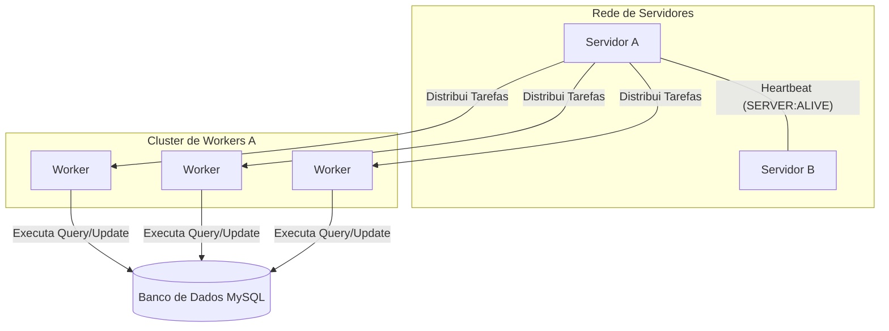

## 🚀 Guia de Execução Rápida (Quick Start)

1.  **Clone o repositório:**
    ```bash
    git clone https://github.com/Jotagamaral/Arquitetura-de-Sistemas-Distribuidos-Grupo-1.git
    cd projeto
    ```

2.  **Instale as dependências:**
    ```bash
    pip install websockets mysql-connector-python
    ```

3.  **Configure o Banco de Dados:**
    * Certifique-se de que seu servidor MySQL está rodando.
    * Execute o script SQL para criar as tabelas (veja a seção `5. Como Executar o Projeto` para o código SQL).
    * Ajuste as credenciais do banco em `client.py`.

4.  **Inicie os Servidores:**
    * Abra um terminal para cada instância do servidor que deseja executar.
    * Ajuste `MY_ADDRESS` e `PEER_SERVERS` em cada arquivo.
    ```bash
    # Terminal 1
    python server_8765.py

    # Terminal 2
    python server_8766.py
    ```

5.  **Inicie o Cliente de Teste (Worker):**
    * Ajuste os parâmetros de teste em `client.py`.
    * Em um novo terminal, execute:
    ```bash
    python client.py
    ```

    ## 🏛️ Arquitetura Visual



### 📡 Tabela Resumo do Protocolo de Aplicação

Este snippet foca em detalhar as "regras do jogo" da comunicação entre os serviços, um dos pontos-chave do seu projeto.

```markdown
## 📡 Protocolo de Aplicação

A comunicação entre os componentes segue as regras customizadas abaixo, utilizando JSON sobre WebSocket/TCP.

### Interação: Servidor ↔ Worker
| Passo | Direção | Mensagem (Exemplo JSON) | Propósito |
| :--- | :--- | :--- | :--- |
| 1 | Worker → Servidor | `{"WORKER": "ALIVE"}` | Apresentar-se e pedir tarefa. |
| 2 | Servidor → Worker | `{"TASK": "QUERY", "USER": "..."}` | Enviar uma tarefa de consulta. |
| 3 | Worker → Servidor | `{"STATUS": "OK NOK", "SALDO": 99.99, "TASK":"QUERY", "..."}` | Devolver o resultado bem-sucedido. |

### Interação: Servidor ↔ Servidor (Peer)
| Passo | Direção | Mensagem (Exemplo JSON) | Propósito |
| :--- | :--- | :--- | :--- |
| 1 | Servidor A → Servidor B | `{"SERVER": "ALIVE"}` | Enviar um sinal de vida (heartbeat). |
