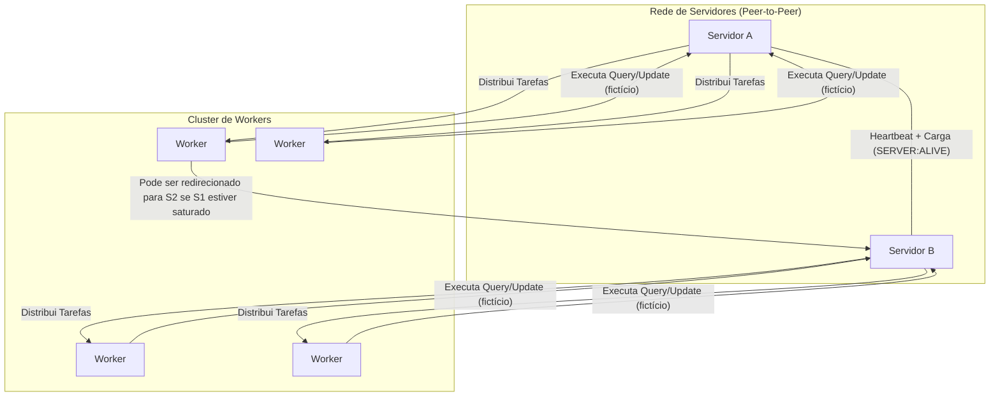

# Sistema Distribuído de Servidor e Worker

**Integrantes**: João Gabriel, Carlos Eduardo e Arthur Gomes.

**Repositório**: [Jotagamaral/Arquitetura-de-Sistemas-Distribuidos-Grupo-1](https://github.com/Jotagamaral/Arquitetura-de-Sistemas-Distribuidos-Grupo-1)

## 1. Visão Geral do Projeto

Este projeto implementa um sistema distribuído em Python projetado para processar tarefas de consulta e atualização de saldos de contas. A arquitetura demonstra a comunicação assíncrona entre múltiplos serviços, balanceamento de carga dinâmico e escalabilidade de componentes.


O ecossistema é composto por:
* **Servidores (`server_runner.py` + `server_lib/`)**: Orquestradores que gerenciam workers, distribuem tarefas e comunicam-se entre si para monitoramento de carga e status (heartbeat). Toda a lógica do servidor está modularizada na pasta `server_lib/`.
* **Workers (`client.py`)**: Executores de tarefas que se conectam aos servidores e retornam resultados (fictícios).

## 2. 🚀 Guia de Execução Rápida (Quick Start)

1.  **Clone o repositório:**
    ```bash
    git clone [https://github.com/Jotagamaral/Arquitetura-de-Sistemas-Distribuidos-Grupo-1.git](https://github.com/Jotagamaral/Arquitetura-de-Sistemas-Distribuidos-Grupo-1.git)
    cd Arquitetura-de-Sistemas-Distribuidos-Grupo-1
    ```

2.  **Instale as dependências:**
    ```bash
    pip install websockets loguru
    ```


3.  **Configure e Inicie os Servidores:**
    * Para cada instância de servidor, duplique o arquivo `server_runner.py` (ex: `server_runner_8765.py`, `server_runner_8766.py`).
    * Ajuste as configurações de IP, PORTA e peers em `server_lib/config.py` para cada instância.
    * Em cada terminal, execute:
    ```bash
    python server_runner.py
    # ou para outra instância
    python server_runner_8766.py
    ```
    * Os logs são salvos em `log_server.txt` e exibidos no terminal, utilizando a biblioteca `loguru`.

4.  **Inicie o Cliente de Teste (Worker):**
    * Ajuste os parâmetros de teste em `client.py`.
    * Em um novo terminal, execute:
    ```bash
    python client.py
    ```

## 3. 🏛️ Arquitetura Visual


### 📡 Tabela Resumo do Protocolo de Aplicação


> **Nota:**
> - As operações de consulta e atualização são simuladas/fictícias, sem integração real com banco de dados.
> - Toda a comunicação, heartbeat e monitoramento de peers é registrada em log com a biblioteca `loguru` (arquivo `log_server.txt`).
> - Para criar múltiplos servidores, basta duplicar `server_runner.py` e ajustar `server_lib/config.py`.

Este snippet foca em detalhar as "regras do jogo" da comunicação entre os serviços, um dos pontos-chave do seu projeto.

```markdown
## 5. 📡 Protocolo de Aplicação

A comunicação entre os componentes segue as regras customizadas abaixo, utilizando JSON sobre WebSocket/TCP.

### Interação: Servidor ↔ Worker
| Passo | Direção | Mensagem (Exemplo JSON) | Propósito |
| 1 | Worker → Servidor | `{"WORKER": "ALIVE"}` | Apresentar-se e pedir tarefa. |
| 2 | Servidor → Worker | `{"TASK": "QUERY", "USER": "..."}` | Enviar uma tarefa de consulta. |
| 3 | Worker → Servidor | `{"STATUS": "OK", "SALDO": 99.99, ...}` | Devolver o resultado com sucesso. |
| 4 | Worker → Servidor | `{"STATUS": "NOK", "TASK": "QUERY", "ERROR": "User not found"}` | Informar que a execução da tarefa falhou.|
| 5 | Servidor → Worker | `{"TASK": "REDIRECT", "TARGET_MASTER": {"IP": "...", "PORT": ...}, "HOME_MASTER": {"IP": "...", "PORT": ...}, "FAILOVER_LIST": [...]}` | Comando de Empréstimo: O Servidor "Pai" ordena que o Worker se conecte a um TARGET_MASTER temporário.| 

### Interação: Servidor ↔ Servidor (Peer)
| Passo | Direção | Mensagem (Exemplo JSON) | Propósito |
| 1 | Servidor A → Servidor B | `{"SERVER": "ALIVE", "TASK": "REQUEST"}` | Enviar um sinal de vida (heartbeat). |
| 2 | Servidor B → Servidor A | `{"SERVER": "ALIVE" ,"TASK":"RECIEVE"}` | Recebe um sinal de vida (heartbeat). |

| 3 | Servidor A → Servidor B | `{"TASK": "WORKER_REQUEST", "WORKERS_NEEDED": 5}` | Enviar um pedido de trabalhadores emprestado. |
| 4.1 | Servidor B → Servidor A | `{"TASK": "WORKER_RESPONSE", "STATUS": "ACK", "MASTER":"UUID",  "WORKERS": ["WORKER_UUID": ...] }` | Enviar uma resposta positiva de pedido de trabalhadores emprestado. |
| 4.2 | Servidor B → Servidor A | `{"TASK": "WORKER_RESPONSE", "STATUS": "NACK",  "WORKERS": [] }` | Enviar uma resposta negativa de pedido de trabalhadores emprestado. |

| 4.3 | Worker (Emprestado) → Servidor A | `{"WORKER": "ALIVE", "WORKER_UUID":"..."}` | Worker emprestado envia uma conexão para o servidor saturado. |
