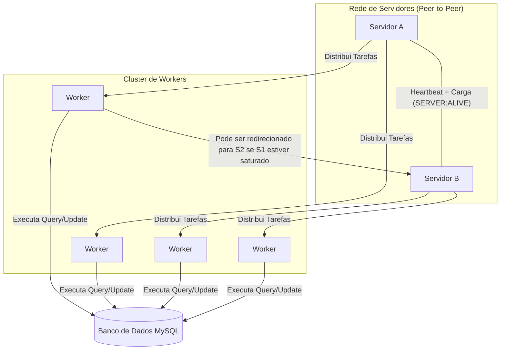

# Sistema Distribuído de Consulta e Atualização de Saldo

**Autor**: João Gabriel  
**Data**: 25 de Setembro de 2025  
**Repositório**: [Jotagamaral/Arquitetura-de-Sistemas-Distribuidos-Grupo-1](https://github.com/Jotagamaral/Arquitetura-de-Sistemas-Distribuidos-Grupo-1)

## 1. Visão Geral do Projeto

Este projeto implementa um sistema distribuído em Python projetado para processar tarefas de consulta e atualização de saldos de contas. A arquitetura demonstra a comunicação assíncrona entre múltiplos serviços, balanceamento de carga dinâmico e escalabilidade de componentes.

O ecossistema é composto por:
* **Servidores (`server.py`)**: Orquestradores que gerenciam workers, distribuem tarefas e comunicam-se entre si para monitoramento de carga e status (heartbeat).
* **Workers (`client.py`)**: Executores de tarefas que se conectam aos servidores, interagem com o banco de dados e retornam resultados.
* **Banco de Dados (MySQL)**: A camada de persistência para os dados dos usuários.

## 2. 🚀 Guia de Execução Rápida (Quick Start)

1.  **Clone o repositório:**
    ```bash
    git clone [https://github.com/Jotagamaral/Arquitetura-de-Sistemas-Distribuidos-Grupo-1.git](https://github.com/Jotagamaral/Arquitetura-de-Sistemas-Distribuidos-Grupo-1.git)
    cd Arquitetura-de-Sistemas-Distribuidos-Grupo-1
    ```

2.  **Instale as dependências:**
    ```bash
    pip install websockets mysql-connector-python
    ```

3.  **Configure o Banco de Dados:**
    * Certifique-se de que seu servidor MySQL está rodando.
    * Execute o script SQL para criar as tabelas (disponível na seção `6. Configuração e Execução`).
    * Ajuste as credenciais do banco de dados nos arquivos `client.py` e `server.py`.

4.  **Inicie os Servidores:**
    * Abra um terminal para cada instância do servidor.
    * Ajuste as configurações `MY_ADDRESS` e `PEER_SERVERS` em cada arquivo de servidor.
    ```bash
    # Terminal 1
    python server_8765.py

    # Terminal 2
    python server_8766.py
    ```

5.  **Inicie o Cliente de Teste (Worker):**
    * Ajuste os parâmetros de teste em `client.py`.
    * Em um novo terminal, execute:
    ```bash
    python client.py
    ```

## 3. 🏛️ Arquitetura Visual


### 📡 Tabela Resumo do Protocolo de Aplicação

Este snippet foca em detalhar as "regras do jogo" da comunicação entre os serviços, um dos pontos-chave do seu projeto.

```markdown
## 5. 📡 Protocolo de Aplicação

A comunicação entre os componentes segue as regras customizadas abaixo, utilizando JSON sobre WebSocket/TCP.

### Interação: Servidor ↔ Worker
| Passo | Direção | Mensagem (Exemplo JSON) | Propósito |
| 1 | Worker → Servidor | `{"WORKER": "ALIVE"}` | Apresentar-se e pedir tarefa. |
| 2 | Servidor → Worker | `{"TASK": "QUERY", "USER": "..."}` | Enviar uma tarefa de consulta. |
| 3 | Worker → Servidor | `{"STATUS": "OK", "SALDO": 99.99, ...}` | Devolver o resultado com sucesso. |
| 4 | Worker → Servidor | `{"STATUS": "NOK", "TASK": "QUERY", "ERROR": "User not found"}` | Informar que a execução da tarefa falhou.|
| 5 | Servidor → Worker | '{"TASK": "REDIRECT", "TARGET_MASTER": {"IP": "...", "PORT": ...}, "HOME_MASTER": {"IP": "...", "PORT": ...}, "FAILOVER_LIST": [...]}' | Comando de Empréstimo: O Servidor "Pai" ordena que o Worker se conecte a um TARGET_MASTER temporário.| 

### Interação: Servidor ↔ Servidor (Peer)
| Passo | Direção | Mensagem (Exemplo JSON) | Propósito |
| 1 | Servidor A → Servidor B | `{"SERVER": "ALIVE", "TASK": "REQUEST"}` | Enviar um sinal de vida (heartbeat). |
| 2 | Servidor B → Servidor A | `{"SERVER": "ALIVE" ,"TASK":"RECIEVE"}` | Recebe um sinal de vida (heartbeat). |

| 3 | Servidor A → Servidor B | `{"TASK": "WORKER_REQUEST", "WORKERS_NEEDED": 5}` | Enviar um pedido de trabalhadores emprestado. |
| 4.1 | Servidor B → Servidor A | `{"TASK": "WORKER_RESPONSE", "STATUS": "ACK", "MASTER":"UUID",  "WORKERS": ["WORKER_UUID": ...] }` | Enviar uma resposta positiva de pedido de trabalhadores emprestado. |
| 4.2 | Servidor B → Servidor A | `{"TASK": "WORKER_RESPONSE", "STATUS": "NACK",  "WORKERS": [] }` | Enviar uma resposta negativa de pedido de trabalhadores emprestado. |

| 4.3 | Worker (Emprestado) → Servidor A | `{"WORKER": "ALIVE", "WORKER_UUID":"..."}` | Worker emprestado envia uma conexão para o servidor saturado. |


